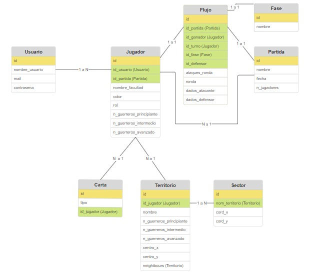

# grupo-Colibries-backend

## Setup

1. Primero, correr `yarn` para descargar las dependencias de la api.

2. Crear archivo **.env** y agregar:

        DB_USERNAME = [tu username]
        DB_PASSWORD = [tu password]
        DB_NAME = juegoweb
        DB_HOST = 'localhost'

3. Correr los siguientes commandos en el **terminal** para crear la base de datos, migrarla y seedearla:

        yarn sequelize-cli db:create
        yarn sequelize-cli db:migrate
        yarn sequelize-cli db:seed:all

4. Finalmente, correr lo siguiente en el **terminal** para empezar el servidor:

        yarn dev

## Relaciones y Entidades

Se siguió el siguiente diagrama de clases para construir la base de datos.

## Lógica de juegos

Se implementaron las siguientes acciones de lógica de juego

### Ruta users

- `GET` para obtener todos los usuarios registrados.

        GET /users/

- `GET` para obtener un usuario específico según su `id`.

        GET /users/:id

### Ruta admin

- `GET` para obtener todos los usuarios registrados.

        GET /admin/users

- `GET` para obtener todos los jugadores registrados.

        GET /admin/players

- `GET` para obtener todas las partidas registrados.

        GET /admin/games

- `Put` para eliminar un usuario según su `id`.

        GET /admin/deleteuser
        JSON { "userId": id del usuario }

- `Put` para eliminar un jugador según su `id`. Elimina a la partida que le pertenece, y con ella a todos los jugadores que pertenecen a la partida.

        GET /admin/deleteplayer
        JSON { "playerId": id del usuario }

- `Put` para eliminar una partida según su `id`. Elimina a todos los jugadores presentes en esa partida.

        GET /admin/deletegame
        JSON { "gameId": id del usuario }

### Ruta scope-example

- `GET` para validar que un usuario tenga token con scope "user".

        GET /scope-example/protecteduser
        JSON { "token": token del usuario }

- `GET` para validar que un usuario tenga token con scope "admin".

        GET /scope-example/protectedadmin
        JSON { "token": token del usuario }

- `GET` para validar que un usuario tenga token con scope "partida{id}", pero ignorando el `id` de la partida.

        GET /scope-example/protectedpartida
        JSON { "token": token del usuario }

- `GET` para validar que un usuario tenga token con scope "partida{id}", donde el `id` del token debe ser el mismo del scope.

        GET /scope-example/protectedpartidaid/:id_partida
        JSON { "token": token del usuario }

### Ruta pregame

- `POST` para crear una nueva partida.

        POST /pregame/newgame
        JSON Body: { "user_id": nombre del usuario que crea la partida 
                      "game_name": nombre de la aprtida }

- `POST` para unirse a una partida existente.

        POST /pregame/joingame
        JSON Body: { "user_id": nombre del usuario que se une a la partida 
                      "game_id": id de la partida a la que se une}

- `PUT` para iniciar una partida.

        PUT /pregame/startgame
        JSON Body: { "player_id": id del jugador que inicia la partida
                      "game_id": id de la partida que comienza }

- `GET` para obtener todas las partidas disponibles.

        GET /pregame/getgames

- `GET` para obtener todos los jugadores de una partida específica.

        GET /pregame/getplayers/:gameId
        Parámetro: gameId (ID de la partida)

- `GET` para obtener detalles de una partida específica.

        GET /pregame/getgame/:gameId
        Parámetro: gameId (ID de la partida)

- `PUT` para abandonar una partida. Elimina al jugador que estaba en sala de espera.

        PUT /pregame/leavegame
        JSON Body: { "player_id": id del jugador que abandona la partida
                      "game_id": id de la partida que se abandona }

### Ruta game

- `PUT` para manejar el reforzamiento en una partida. Se envía el `id` del jugador que realiza la acción.

        PUT /game/reforzamiento/:id_partida
        JSON Body: { id_jugador:
                     id_territorio:
                     n_guerreros_principiantes:
                     n_guerreros_intermedios:
                     n_guerreros_avanzados:}

- `PUT` para manejar el desplazamiento en una partida. Se envía el `id` del jugador que realiza la acción.

        PUT /game/desplazamiento/:id_partida
        JSON Body: { player_id:
                     territorio_origen_id:
                     territorio_destino_id:
                     n_guerreros_principiantes:
                     n_guerreros_intermedios:
                     n_guerreros_avanzados:}

- `PUT` para usar una carta en una partida. Se envia el `id` del jugador que la usa.

        PUT /game/usar_carta/:id_partida
        JSON Body: { player_id: 
                     carta_tipo: }

- `PUT` para manejar el cambio de turno en una partida. Se envía el `id` del jugador que realiza la acción.

        PUT /game/handleTurno/:id_partida
        JSON Body: { player_id: }

- `PUT` para manejar el ataque en una partida. Se envía el `id` del jugador que realiza la acción.

        PUT /game/attack/:id_partida
        JSON Body: { player_id: 
                     territorio_atacante_id:
                     territorio_defensor_id:
                     n_guerreros_principiantes:
                     n_guerreros_intermedios:
                     n_guerreros_avanzados: }

### Ruta flujo

- `GET` para cargar el mapa de una partida. Se envía el `id` de la partida que realiza la acción.

        GET /flujo/map/:id_partida
        Parámetro: id_partida (ID de la partida)

- `GET` para cargar información de una partida y jugador específicos. Se envía el `id` correspondiente a la partida.

        GET /flujo/:id_partida/:playerId
        Parámetro: id_partida (ID de la partida), playerId (ID del jugador)

### Ruta postgame

- `GET` para obtener información de una partida después de su finalización. Según el `id` de la partida finalizada.

        GET /postgame/:id_partida
        Parámetro: id_partida (ID de la partida)

### Ruta historial

- `GET` para obtener el historial general de partidas.

        GET /historial/

- `GET` para obtener el historial de una partida específica, según su `id`.

        GET /historial/game/:id_partida
        Parámetro: id_partida (ID de la partida)

- `GET` para obtener el historial de un usuario específico. Se envía `id` del usuario, para cargar las partidas en las que ha participado.

        GET /historial/user/:id_usuario
        Parámetro: id_usuario (ID del usuario)

## Validaciones y restricciones

### Restricciones

- `User`: Existen restricciones de no tolerar Nulls para el `nombre`, `contraseña` y `mail`. Además el `nombre` y `mail` trata como único.
- Como el modelo `User` es el único que interactua con el usuario, es el único campo que requiere restricciones ya que el resto es incorporado por nosotros y no es necesario incluirlas.

### Validaciones

- `User`: Existen validaciones de que el `nombre` debe ser alfanumérico. También el `mail` debe tener un formato email, que está implementado. Además creamos una validación personalizada para la `contraseña`, ya que debe contener al menos 4 caracteres.

- Al igual que con las restricciones, como el modelo `User` es el único que interactua con el usuario, es el único campo que requiere validaciones ya que el resto es manejado dentro del juego y no es necesario incluirlas.